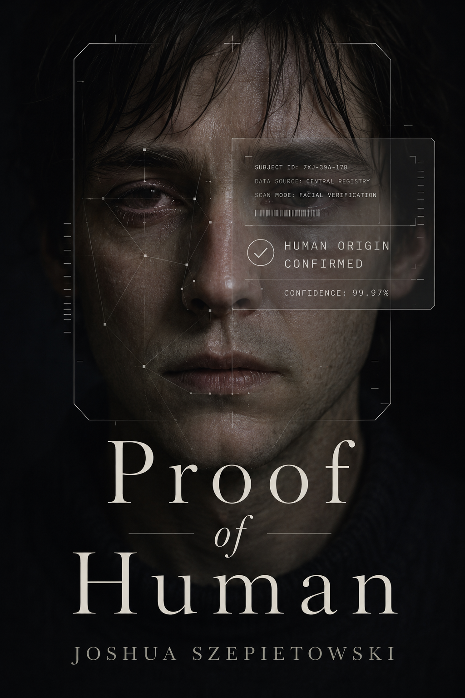

# Proof of Human

*Joshua Szepietowski*

**Proof of Human** is a near-future literary science fiction horror novel about a world where AI-generated media has become indistinguishable from human-created reality. Text, voice, video, testimony, confession, memory, journalism, political scandal, private intimacy, and apparent live communication can all be synthesized with perfect conviction.

The result is not the disappearance of reality. Reality still happens. The catastrophe is the collapse of shared confidence in it.

The novel follows **Nathan Keene**, a former CommonProof Senior Safety Architect now working at the Carver Institute for Civic Evidence in Cambridge. When Nathan sees his missing former teammate **Claire Anik** appear in a certified liveness demo and use their old phrase, "insufficiently false," as an SOS, he and his estranged sister **Tessa Keene** uncover a proof system that can verify a person is alive without proving they are free.

The central premise:

> When anything beautiful can be generated, suffering becomes the last trusted signal of authenticity.

The book is not an "AI is evil" story. The machines create convincing fiction; human institutions, markets, governments, and private longings respond by turning proof into a demand placed on the vulnerable. The horror lives in the clean interfaces, legal categories, certification protocols, subscription tiers, moderation queues, elections, family disputes, and courtrooms that normalize this demand.

The title has several meanings:

- Proof that a piece of media was created by a human.
- Proof that an event really happened to a human.
- Proof that humanity still means something in an age of infinite simulation.
- Proof demanded by systems that no longer trust ordinary experience.
- Proof extracted from suffering, vulnerability, grief, humiliation, risk, and mortality.

The core thematic question:

> What are we willing to do to each other in order to stop doubting?

## Genre And Tone

- Near-future literary science fiction.
- Institutional and psychological horror.
- Social critique rather than gadget thriller.
- Emotionally grounded, morally tense, and bureaucratically plausible.
- Clean contemporary surfaces with spiritual rot underneath.

Avoid generic cyberpunk aesthetics. This world should feel like the present extended by a few legal fights, platform updates, premium trust services, school policies, courtroom standards, creator monetization tools, and international treaties.

## Core Documents

- [CONCEPT.md](notes/CONCEPT.md): Full premise and central moral inversion.
- [THEMES.md](notes/THEMES.md): Thematic architecture and philosophical tensions.
- [WORLD.md](notes/WORLD.md): Everyday life, institutions, media, law, work, family, grief, and culture.
- [GEOPOLITICS.md](notes/GEOPOLITICS.md): International systems, treaties, conflict, elections, war, and intelligence.
- [TERMINOLOGY.md](notes/TERMINOLOGY.md): Glossary of in-world language.
- [CHARACTERS.md](notes/CHARACTERS.md): Canon cast, relationships, wounds, and arcs.
- [STORY_ARCHITECTURE.md](notes/STORY_ARCHITECTURE.md): High-level canon plot architecture from Boston/Cambridge to Geneva.
- [OUTLINE.md](notes/OUTLINE.md): Chapter-by-chapter working outline across 21 chapters.
- [SCENES.md](notes/SCENES.md): High-value scene bank.
- [VOICE.md](notes/VOICE.md): Style, narration, point of view, and prose principles.
- [VOICES.md](notes/VOICES.md): Character speech, diction, rhythm, and institutional registers.
- [QUESTIONS.md](notes/QUESTIONS.md): Remaining craft checks and drafting details.
- [DO_NOT_DO.md](notes/DO_NOT_DO.md): Creative traps to avoid.

## Canon Direction

The story is intimate institutional suspense rather than a globe-spanning conspiracy thriller. Journalism is on its dying breath and does not save the day. The Red Market stays offstage. The climax occurs in Geneva, where Claire refuses to become a new category of certified suffering. The ending is not systemic victory, but a narrow breach, an unsigned sign of Claire's agency, and a small restored trust between Nathan and Tessa.
